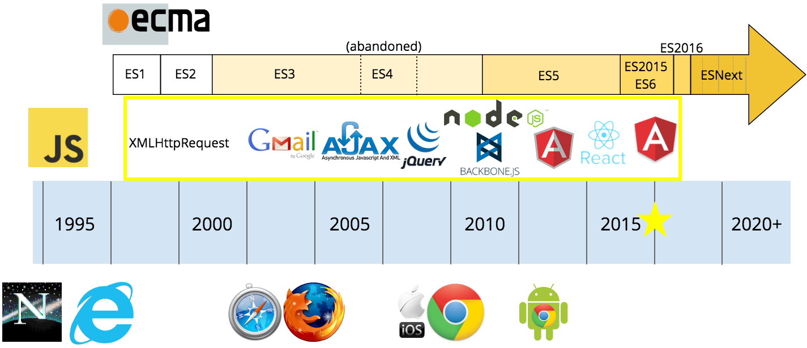

# Introducción a node.js


## Qué es node.js 
- [Sitio web de node.js](https://nodejs.org/en/):
> Node.js® is a JavaScript runtime built on Chrome's V8 JavaScript engine.

- Node.js es un intérprete de JavaScript que se ejecuta en servidor (sin navegador).


## [Situación actual del desarrollo web](https://github.com/kamranahmedse/developer-roadmap)


## Google Chrome V8

- Es el motor de JavaScript que utiliza Google Chrome y node
  - Escrito en C++
  - [Motor de código abierto](https://chromium.googlesource.com/v8/v8.git)
  - Compila a código máquina


### Instalación.

- ¿Qué necesitamos instalar?
  - **Node.js**: entorno de ejecución de JavaScript orientado a eventos asíncronos.
  - **npm**. Node Package Manager es un gestor de paquetes. Composer se basa en npm. Permite agragar dependencias y distribuir paquetes
  - **nvm**. Node Version Manager.


- Si instalamos node de forma *simple* sólo tenemos una versión de node. La última.
- Si trabajamos con múltiples proyectos puede ser que necesitemos varias versiones:
- Nvm nos permite tener varias instaladas y seleccionar la que necesitemos en cada proyecto.


## Hola Mundo en node


## Hola Mundo en browser


## HTML DOM


## Objeto Window en JavaScript

- Objeto global en JavaScript
- Almacena todo sobre lo que se tiene acceso


## Objeto "Window" en Node

- El objeto global en Node, se llama **global**:


## Objeto Document en JavaScript

- Lo que se está viendo en el navegador
- Podemos modificarlo en runtime


## Objeto Process en node

```js
$ node
> process
....
> process.exit(3) // también podríamos hacer .exit(3), o CTRL +C dos veces
$ echo $?
3
```

- process (node) = document (JavaScript)
- Vemos la información del proceso node que se está ejecutando:
  - pid
  - versión de node
  - métodos
  - ...


## Node vs JavaScript

- El código en ambos es JavaScript
- Ambos se ejecutan con el mismo motor (si usamos Chrome)
- Node utiliza el motor fuera del contexto del navegador
  - No hay un *browser sandbox*
  - Tenemos funcionalidad añadida:
    - Acceso al file system
    - Acceso a bbdd *completa*
    - Incluso montar un servidor web


## Funcionamiento código

- Se lee el codigo en JavaScript
- Se compila a código máquina por el V8 y se ejecuta:

>V8 compiles JavaScript directly to native machine code before executing it, instead of more traditional techniques such as interpreting bytecode or compiling the whole program to machine code and executing it from a filesystem. The compiled code is additionally optimized (and re-optimized) dynamically at runtime, based on heuristics of the code's execution profile. 
[(wikipedia)](https://en.wikipedia.org/wiki/Chrome_V8)


## Características de node

- **Mismo lenguaje en cliente y servidor**
  - Permite a cualquier persona desarrollar en backend o en frontend
  - Permite reusar código o incluso mover código de cliente a servidor o al revés

- **No bloqueante (asíncrono) por naturaleza**
  - Los métodos síncronos, llevan el sufijo sync


- El **mayor repositorio de código disponible**: [npm](https://www.npmjs.com/)
  - composer(php) o jpm(java) están basados en npm

- **Orientado a eventos**

- Es **monohilo**
  - Utiliza un solo procesador
  - Si queremos usar toda la potencia de la CPU, tendremos que levantar varias instancias de node y utilizar un repartidor* de carga ([P.ej. pm2](https://github.com/Unitech/pm2))

    * _Balancer_ no es balanceador (_false friend_) 


- Llamadas síncronas en servidor serían fatales:
  - ¡Bloqueariamos las conexiones al servidor hasta que acabase la instrucción bloqueante!
  - Al ser asíncrono podremos tener muchas sesiones concurrentes


## Ejemplo código no bloqueante

```js
const fs = require('fs')
fs.readFile('./prueba.txt', 'utf-8', (err, data) => {
  if (err) throw err
  console.log(`El contenido del fichero es este: ${data}`)
})
console.log(`Aquí todavia no tenemos el valor de fs.readFile`)
```


## Ejemplo código bloqueante

```js
const fs = require('fs');
const data = fs.readFileSync('./prueba.txt', 'utf-8');
console.log(`El contenido del fichero es este: ${data}`)
```


## Consulta de API de node

- El módulo fs pertenence a los core modules de node, no es necesario instalarlo
- Para consultar la API:
  - [Desde el navegador](https://nodejs.org/api/index.html)
  - Desde el terminal (plugin node de zsh)
    ```bash
      $ node-docs
     ```


## Bloqueante vs no bloqueante

- El **código asíncrono** tiene un **throughput mucho mayor**.
- Se puede volver **complejo** el trabajar con el resultado de una función asíncrona.
  - El código asíncrono no se ejecuta de forma secuencial, más dificil de seguir
  - El método asíncrono recibe como último parámetro una **función de callback**


## ¿Qué sería lo ideal?

- Utilizar **código secuencial y asíncrono**
  - Para ello utilizaremos **promesas** y **async/await**
- Evitaremos la anidación de funciones de callback, conocido como **callback hell**


# Versiones de JS


## ECMAScript

- Estándarización del JavaScript de NetScape (1997)
- Implementaciones de ECMAScript:
  - JavaScript
  - JScript (Microsoft)
  - ActionScript (Adobe)
  - ..


## [TC39](https://github.com/tc39/)

- [Cómite técnico encargado de la especificación de ECMAScript](https://github.com/orgs/tc39/people)
  - Yahoo
  - Paypal
  - Google
  - Microsoft
  - ....


## JavaScript timeline


## ECMAScript 4
- A favor de grandes cambios:
  - Microsoft (Silverlight con C#)
  - Adobe (Adobe air con ActionScript)
- A favor de mantener compatibilidad con lo anterior:
  - Google
  - Yahoo


## ECMAScript 5
- No tiene tantas grandes novedades
- jQuery nace en el 2006 para paliar las diferencias entre navegadores


## ECMAScript 6
- Grandes novedades
- Se pueden usar [transpilers](https://babeljs.io/)





## Versiones actuales
- ES6: Jun 2015
  - El comite decidió publicar especificaciones ECMAScript de forma anual
  - Se renombro a **ES2015** 

- **ES2016** (ES7)

- **ES2017** (ES8) ... **ES2019** (ES10) 

- **ES.Next**: Término dinámico, se refiere a la próxima versión de ECMAScript.


## ¿Qué puedo usar?

- En Web tenemos que vivir con la fragmentación 
  - V8 - Google Chrome (Chromium, MongoDB)
  - SpiderMonkey Firefox (GNOME, Adobe).
  - Chakra -  Microsoft IE y Edge
- En Node es más sencillo porque:
  - Solo hay un motor: v8
  - Nosotros elegimos su versión


## Tablas de compatibilidades

- Node: 
  - http://kangax.github.io/compat-table/es5/
  - https://node.green/

- Web:
  - https://caniuse.com

**¿Empezamos el código?**


# Módulos


## ¿Qué son los módulos?

- Los módulos en Node.js pueden considerarse librerías.
- Es el elemento que nos permite dividir un proyecto en unidades de código más pequeñas.


## Módulos incorporados en Node.js
- Node incorpora un buen número de módulos para ser utilizados en nuestros proyectos:
 - **fs** para el sistema de ficheros.
 - **os** para el sistema operativo.
 - **http** para montar un servidor web. ...


## Usar módulos incorporados

- Para incluir módulos debemos usar *require(nombremodulo)*:
- Consultar en https://nodejs.org/es/docs/

```javascript
  const http = require('http'); //mejor const que let o var

  http.createServer(function (req, res) {
    res.writeHead(200, {'Content-Type': 'text/html'});
    res.end('Hola Mundo!!');
  }).listen(8080);
```


### require

- *require* es un módulo que está en el objeto global
- Este código no es necesario:
 
  ```js
  require('require');
  ```

- Funciona de forma síncrona
  - Por eso se ponen al comienzo
  - Podríamos colocarlos más tarde y hacer *lazy loading*


## Módulos de terceros
- *npm install* nos permite incorporar módulos de terceros:
- Después son usados con *require()* igualmente

```bash
npm install -h   //muestra ayuda
    // alias de install: aliases: i, isntall, add
npm install -S nombremodulo //guarda referencia en package.json y .lock
    //-S es abreviatura de --save-prod
npm install nombremodulo //sin opción: -S por defecto
npm install -D nombremodulo //idem pero sólo como dependencia de desarrollo
    //-D es abreviatura de --save-dev
```


# Módulos propios


## Crear módulos propios:

1. Crear un fichero javascript con definición de funciones, clases, constantes, ...
  - Cualquier fichero con definición de funciones, variables, constantes, ...
2. Uso de *exports*
  - Las funciones o variables que puedan usarse desde el exterior se declaran con exports:
  ```js
  const saludo = "Hola";
  exports.saludo;
  ```
 Veamos ejemplos:


 ** Ejemplo 1 **

- Crear módulo en mensaje.js

```js
module.exports = 'Hola Mundo!';

//or

exports = 'Hola Mundo!';
```

- Usar el módulo en app.js

```js
const msg = require('./mensaje.js');

console.log(msg);
```


 ** Ejemplo 2 **

- Crear módulo en mensaje.js

```js
exports.saludo = 'Hola Mundo!';

//or

module.exports.saludo = 'Hola Mundo!'
```

- Usar el módulo en app.js

```js
const msg = require('./mensaje.js');

console.log(msg.saludo);;
```


** Ejemplo 3. Exportar función **

- Fichero log.js

```js
module.exports.log = function (msg) { 
    console.log(msg);
};
```
Objeto exportado:
```js
{ log : function(msg){ console.log(msg); } }
```

Uso en app.js

```js
const msg = require('./Log.js');

msg.log('Hello World');
```


** Ejemplo 4. Exportar objeto JSON **

- Fichero data.js

```js
module.exports = {
    firstName: 'James',
    lastName: 'Bond'
}
```
- Uso en app.js

```js
const person = require('./data.js');
console.log(person.firstName + ' ' + person.lastName);
```


** Ejemplo 5. Un módulo como una clase **

Módulo Person.js

```js
module.exports = function (firstName, lastName) {
    this.firstName = firstName;
    this.lastName = lastName;
    this.fullName = function () { 
        return this.firstName + ' ' + this.lastName;
    }
}
```

Ejemplo de uso en app.js

```js
const person = require('./Person.js');
const person1 = new person('James', 'Bond');
// o en una linea: 
//const person1 = require('./Person.js')('James', 'Bond');
console.log(person1.fullName());
```


** Ejemplo 6. Múltiples exports ** 

```js
module.exports = {
    method: function() {},
    otherMethod: function() {}
}
```
O simplemente: 

```js
exports.method = function() {};
exports.otherMethod = function() {};
```
Y lo usaríamos así:

```js
const MyMethods = require('./myModule.js');
const method = MyMethods.method;
const otherMethod = MyMethods.otherMethod;
```


** Ejemplo 7. Las funciones pueden estar definidas previamente ** 

```js
const function1 = function () {
  //código
}
const function2 = function () {
  //código
}
const function3 = function () {
  //código
}

module.exports = {
   function1,
   function2,
   function3
}
```


** Ejemplo 8. Usando funciones flecha **

```js
const method = () => {
   // your method logic
}

const otherMethod = () => {
   // your method logic 
}

module.exports = {
    method, 
    otherMethod,
    // anotherMethod
};
```


## Caso Práctico

- [Hola Usuario](./hola.md)
<!-- - [Hola Usuario 2](./1-hola.md#/0/13) -->


# Módulo Http


## Node como servidor Http

- Necesitamos usar el módulo Http:

```js
const http = require('http');
```

- Ejemplo: 

```js
var http = require('http');

//crear servidor:
http.createServer(function (req, res) {
  res.write('Hola mundo!'); //escribir respuesta al cliente
  res.end(); //cerrar respuesta
}).listen(8080, () => console.log("Servidor en localhost:8080"));
```


## Headers

- Podemos agruegar cabecerars HTTP

- Ejemplo: 

```js
var http = require('http');
http.createServer(function (req, res) {
  res.writeHead(200, {'Content-Type': 'text/html'}); //cabecera
  res.write('Hello World!');
  res.end();
}).listen(8080, () => console.log("Servidor en localhost:8080"));
```


## Request

- Podemos tomar toda la información del request
- Por ejemplo la URL:

```js
var http = require('http');
http.createServer(function (req, res) {
  res.writeHead(200, {'Content-Type': 'text/html'});
  res.write(req.url);
  res.end();
}).listen(8080, () => console.log("Servidor en localhost:8080"));
```


** O los parámetros GET **

```js
const http = require('http');
const url = require('url');

http.createServer(function (req, res) {
  res.writeHead(200, {'Content-Type': 'text/html'});
  let query = url.parse(req.url, true).query;
  //let txt = 'Hola ' + query.name + " " + query.surname;
  let txt = `Hola ${query.name} ${query.surname}`;
  res.end(txt);
}).listen(8080, () => console.log("Servidor en localhost:8080"));
```


# Configurar Visual Code
- Vamos a moficiar la configuración de Visual Code
- Vamos a instalar eslint como linter
- Vamos a modificar algunas configuraciones de preferecias y atajos:


## Atajos

- Añadimos el siguiente JSON para la configuración de shortcuts:
```js
// Place your key bindings in this file to override the defaults
[
{
    "key": "ctrl+shift+d",
    "command": "editor.action.copyLinesDownAction",
    "when": "editorTextFocus"
},
{
    "key": "ctrl+shift+up",
    "command": "editor.action.moveLinesUpAction",
    "when": "editorTextFocus"
},
{
    "key": "ctrl+shift+down",
    "command": "editor.action.moveLinesDownAction",
    "when": "editorTextFocus"
}
]
```


- Si usamos linux y gnome:
  - El atajo de multicursor es `alt+click` pero esta combinación está usada por gnome
  - Así lo cambiamos por super+click y podremos usar la citada combinación de teclas:

```bash
gsettings set org.gnome.desktop.wm.preferences mouse-button-modifier "<Super>"
```


## esLint

- Vamos a usar esLint como linter para:
  - Que nos ayude a generar un código homogéneo.
  - Que nos ayude a detectar errores.

- Instalación como dependencia de desarrollo del proyecto:

```bash
npm i -D eslint
```


## Configuración de eslint

```bash
$ node_modules/.bin/eslint --init # o npx eslint --init
? How would you like to configure ESLint? 
  Use a popular style guide
? Which style guide do you want to follow? 
  Standard
? What format do you want your config file to be in? 
  JSON
? Would you like to install them now with npm? 
  Yes
```


## Análisis configuración

- *.eslintrc.json* tiene la configuración de nuestro linter
- [Podríamos modificarla](https://eslint.org/docs/rules/), por ej:

```json
{
    "extends": "standard",
    "rules": {
        "prefer-const": "error",
        "no-var": "error"
    }
}
```

- Ayuda: Pulsa *CTRL + espacio* para autocompletado


## Modificaciones Visual Code Editor

- Instalamos la extensión Prettier de Esben Petersen
- Su funcionamiento se basa en el fichero eslintrc
- Queremos las modificaciones de eslint al guardar
- Cambiamos las preferencias en Visual Code Editor para formatear nuestro JavaScript:

```json
  "prettier.eslintIntegration": true,
  "eslint.autoFixOnSave": true,
  "javascript.suggestionActions.enabled": false
```


- Observa que prettier tiene unas configuraciones por defecto:

  ```json
    // Whether to add a semicolon at the end of every line
    "prettier.semi": true,

    // If true, will use single instead of double quotes
    "prettier.singleQuote": false,
  ```

- Debemos quedarnos con lo que se define en eslint, que es más parametrizable.
- [Configuración sin Visual Code Editor](https://prettier.io/docs/en/eslint.html)


## Configuración de npm

- Cuando creemos un nuevo proyecto nos interesa que genere automaticamente datos como nuestro nombre o email
- Ver [documentación para su configuación](https://docs.npmjs.com/) o mediante consola:
  - *npm config --help* para ver los comandos de configuración


```bash
npm set init-author-name pepe
npm set init-author-email pepe@pepe.com
npm set init-author-url http://pepe.com
npm set init-license MIT
npm adduser   # login en npmjs.com. Necesiario para publicar
```

- Los cambios se guardan en el fichero $HOME/.npmrc
- *npm adduser* genera un authtoken = login automático al publicar en el registro de npm


## Versiones en node

- Se utiliza [Semantic Versioning](http://semver.org/)
- Formato versiones: ***major.minor.patch***
  - **major**: Cambios en compatibilidad de API
  - **minor**: Añade funcionalidad. Mantiene compatibilidad.
  - **patch**: Soluciona bug. Mantiene compatibilidad.
- ¡Puede obligarnos a cambiar el **major** muy a menudo!