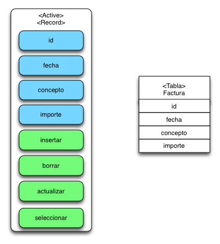

# MVC y  Conexión a BBDD


## Objetivo:

- Vamos a refinar la arquitectura de nuestra aplicación
    - Aplicaremos una arquitectura MVC
    - Aplicaremos el patrón de controlador frontal.
- Vamos a ver como se hace la conexión y acceso a una base de datos. Usaremos un patrón [*Active Record*](https://es.wikipedia.org/wiki/Active_record)
- Completaremos una pequeña aplicación que refleje todo esto
- https://bitbucket.org/rafacabeza/mvc


## Configuración 
- Vamos a usar un nuevo sitio web: mvc.local
- Debes incluirlo en /etc/hosts
- Debes añadir la configuracion en el dockercompose. Directamente puedes usar la rama `mvc`

    ```git
  git checkout --track origin/mvc
    ```
- Debes crear la carpeta `data/mvc`. Allí puedes ir construyenco tu entorno MVC.


### Carpeta public:

- En una aplicación Web servimos el contenido de un directorio.
- Este directorio es conocido como Document Root en Apache.
- Todo lo que hay en él es accesible desde el exterior
- Resulta interesante separar nuestro código *php* y otros recursos de lo que realmente queremos publicar.


- Por defecto el document root de Apache es `/var/www/html`
- Nosotros queremos cambiarlo a `/var/www/html/public`
- Debemos crear nuestra carpeta public: es decir data/mvc/public.
- El resto de contenido dentro de html será inaccesible desde el exterior


- Para lograrlo hay que modificar la configuración de Apache.
- En una instalación común, en el fichero de configuración:

  ```
  DocumentRoot /var/www/html/public
  ```


- Nosotros estamos usando docker y en la rama mvc ya lo tenemos.
- La modificación la realizamos desde nuestro Dockerfile. Debemos añadir:

```
ENV APACHE_DOCUMENT_ROOT=/var/www/html/public
RUN sed -ri -e 's!/var/www/html!${APACHE_DOCUMENT_ROOT}!g' /etc/apache2/sites-available/*.conf
RUN sed -ri -e 's!/var/www/!${APACHE_DOCUMENT_ROOT}!g' /etc/apache2/apache2.conf /etc/apache2/conf-available/*.conf
```


#### Resumen de qué debemos hacer:

- Actualizar entornods y pasar a la rama mvc:

```
cd entornods
git fetch
git checkout --track origin/mvc
```

- Añadir mvc.local a fichero /etc/hosts:

```
127.0.0.1   mvc.local
```


** ¿Funciona? **

- Crea estos ficheros y conecta tu navegador a `mvc.local`

```php
#Fichero `mvc/public/index.php`
<?php
echo 'Contenido en public<br>';
require "../start.php";
```

```php
#Fichero `mvc/start.php`
<?php
echo 'Contenido fuera de public. Privado<br>';
```


## MVC


- El controlador es quien responde a cada petición
  - Recibe ordenes como: quiero la lista de usuarios, añadir uno nuevo, modificarlo, ...
- El modelo se ocupa de obtener los datos, normalmente de una BBDD. También es la clase que los contiene. Típicamente, un registro, un objeto.
- El controlador tras obtener los datos del modelo invoca una vista.


### Ejemplo simplificado sin BBDD

- Rama mvc00.
- Un fichero "cargador": start.php
- Un controlador: Controller.php
- Un modelo: User.php
- Dos vistas: index y show


El fichero *start.php*
```php
<?php
require_once "Controller.php";

$app = new Controller();

if(isset($_GET['method'])) {
    $method = $_GET['method'];
} else {
    $method = 'index';
}

try {
    if(method_exists($app, $method)) {
        $app->$method();
    } else {
        throw new Exception("No encontrado");
    }
} catch (\Throwable $th) {
    http_response_code(404);
    echo $th->message;
}
```


El controlador: 

```php
<?php
require_once('User.php');

class Controller  
{
    public function index()
    {
        $users = User::all();
        // echo json_encode($users);
        require('views/index.php');
    }
    public function show()
    {
        $id = $_GET['id'];
        $user = User::find($id);
        // echo json_encode($user);
        require('views/show.php');
    }
}
```


El modelo:
```php
<?php

class User
{
    const USERS = [
        array(1, 'Juan'),
        array(2, 'Ana'),
        array(3, 'Pepa'),
        array(4, 'Toni')
    ];
    
    public static function all()
    {
        return User::USERS;
    }
    public static function find($id)
    {
        foreach (User::USERS as $key => $user) {
            if ($user[0] == $id) {
                return $user;
            }
        }
        return null;
    }
}
```


Vista del listado:

```php
<h1>Lista de usuarios</h1>    
<table>
    <?php foreach($users as $user) {?>
        <tr>
        <td><?php echo $user[0] ?></td>
        <td><?php echo $user[1] ?></td>
        <td><a href="?method=show&id=<?php echo $user[0] ?>">Ver</a></td>
        </tr>
    <?php } ?>
</table>
```


Vista del detalle:
```php
<h1>Detalle de usuario</h1>
<li>
    <strong>Id: </strong>
    <?php echo $user[0]?>
</li>
<li>
    <strong>Nombre: </strong>
    <?php echo $user[1]?>
</li>
<hr>
<a href="/">Lista</a>
```


## Front Controller y Enrutamiento:


### Situación hasta el momento:

- Rama mvc01
- Inconvenientes de la arquitectura anterior:
  - Si hay múltiples recursos o tablas tendremos múltiples controladores
  - Cada uno de ellos supone un punto de entrada a la aplicación.


### Front Controller: entrada única.

- La existencia de una entrada única:
  - Permite filtrar cualquier petición.
  - Permite realizar tareas sistemáticas:
    - Iniciar sesión
    - Comprobar si el usuario está autorizado


### ¿Qué es Front Controller?

- Se trata de la clase que recibe (casi) todas las peticiones.
- Vamos a hacer que cualquier petición que no responda a un fichero real (css, js, imagen, php,...) llegue a este controlador frontal.


- De acuerdo a la ruta recibida (URI), puede cargar un controlador u otro y ejecutar el método necesario.
- Esta funcionalidad se conoce como **enrutamiento**.
- Es interesante que el enutamiento sea *user friendly*, es decir que evite los parámetros GET:

  ```php
  # parámetros GET
  localhost/index.php?controller=user&method=index
  # misma información usando rutas amigables
  localhost/users
  ```


### Rutas amigables:

- Vamos a hacer que todas las peticiones lleguen a una única clase App de entrada.
- Nosotros escribiremos:

    ```http://mvc.local/user/show```

- Apache interpretará:  

    ```http://mvc.local/index.php?url=user/show```


### Módulo rewrite

- Para lograr esto necesitamos que Apache tenga activo el módulo *rewrite*. 
- Mira tu Dockerfile de mvc, ya está activo.
- Además necesitas un fichero **.htaccess** en el *public*

```
#Contenido del fichero .htaccess. Copia y pega.
#Options +FollowSymLinks
#activar motor de reescritura
RewriteEngine On  
#no sobreescribir directorios o ficheros si existen
#importante para css, js, imágenes, ...
RewriteCond %{SCRIPT_FILENAME} !-d 
RewriteCond %{SCRIPT_FILENAME} !-f 
#regla de reescritura de la url
#RewriteRule ^(.+)*$ index.php?url=$1 [QSA,L]
RewriteRule ^(.*)$ index.php?url=$1 [QSA,L]
```


### Procesar la ruta:

- Nuestro controlador frontal va a ser una clase llamada App.
- Nuestro start.ph debe crear un objeto App.

  ```php
  <?php
  require "../core/App.php";
  $app = new App();
  ```

- El constructor de App llevará toda la ejecución de la aplicación, de acuerdo a la ruta recibida:


- En nuestro proyecto de clase el front controller carga un controlador de manera fija de acuerdo a la ruta y después ejecuta uno de sus métodos:
- Esquema que usaremos: 
  ```
  /controlador/metodo/argumento1/argumento2
  ```
- Por ejemplo la ruta `/user/index`:
  - Carga el controlador UserController 
  - Y ejecuta su método `index()`


- Además tomaremos un controlador y método por defecto:
  - Si no existe controlador tomamos uno por defecto, por ejemplo `index` o `home` .
  - Si no existe método tomamos uno por defecto, por ejemplo `index`
- Veamos:


```php

<?php
class App
{
    function __construct()
    {
        if (isset($_GET['url'])) {
            $url = $_GET['url'];
        } else {
            $url = 'home';
        }

        $arguments = explode('/', trim($url, '/'));
        $controllerName = array_shift($arguments);
        $controllerName = ucwords($controllerName) . "Controller";
        if (count($arguments)) {
            $method =  array_shift($arguments);
        } else {
            $method = "index";
        }

        $file = "../app/controllers/$controllerName" . ".php";
        if (file_exists($file)) {
            require_once $file;
        } else {
            header("HTTP/1.0 404 Not Found");
            echo "No encontrado";
            die();
        }

        $controllerObject = new $controllerName;
        if (method_exists($controllerName, $method)) {
            $controllerObject->$method($arguments);
        } else {
            header("HTTP/1.0 404 Not Found");
            echo "No encontrado";
            die();
        }
    }
}
```


### Un poco de orden:

- Necesitamos usar clases controladoras, modelos y vistas.
- Vamos a borrar las clases Controller y User de días anteriores, y el directorio views.
- Vamos a crear los siguientes directorios:

    ```
    mvc/app/controllers
    mvc/app/models
    mvc/app/views
    ```


** Probando un controlador **

```php
<?php
# app/controllers/UserController
class UserController  
{
    public function __construct()
    {
        echo "en el controller<br>";
    }
    public function index()
    {
        echo "en el index<br>";
    }
    public function show()
    {
        echo "en el show<br>";

    }
}
```
- Ejercicio: Crea y prueba UserController y LoginController


### Primeros controladores y organizar vistas

- Vamos a crear tres controladores básicos que sólo saluden.
- Vamos a añadir un poco de estilo: Bootstrap
- Vamos a dar cierta estructura a nuestras vistas:
    ```
    cabecera
    cuerpo
    pie
    ```


**Controladores básicos**

- Ya hemos creado unos controladores de prueba: home, user y login.
- Vamos a crear una vista para el index de los tres.
- Empezamos con el index y nos vamos a basar en una plantilla Bootstrap para darle un poco de estilo:

    https://getbootstrap.com/docs/4.0/examples/sticky-footer-navbar/


** Ejercicio **
- Copia el código del enlace en una vista llamada *app/views/home.php*.
- Limpia el texto y ajústalo al contenido de nuestra aplicación.
- Separa la vista en tres ficheros:
    - Extrae <small>`<header> ....     </header>`</small> al fichero header.php.
    - Extree <small>`<footer> ... </html>`</small> al fichero footer.php.
- Añade los header y footer al home.php con require y rutas relativas o aboslutas:
    - <small>`<?php require __DIR__ . "/header.php" ?>`</small>
    - <small>`<?php require "../app/views/header.php" ?>`</small>


- Para terminar podríamos separar incluso más ficheros:
    - head.php: El contenido de la eiqueta `<head>`
    - scripts.php: El contenido de los scripts colocados al final del body.


## Namespaces

- Rama mvc02
- El código usado hasta aquí es correcto pero ...
- Si usamos librerías externas podemos tener problemas de colisión de nombres.
- Esto es, que dos clases se llamen igual.
- Para solucionar este problema se usan los namespaces, concepto análogo a los paquetes de java.


- Es como si organizaramos las clases en directorios.
- Dos ficheros con el mismo nombre pueden estar en directorios distintos. Dos clases con el mismo nombre pueden estar en namespaces distintos.
- Es habitual nombrar los directorios (minúsculas: models) y namespaces con el mismo nombre (primera mayúscula: Models)
- Los namespaces tambien se pueden anidar unos dentro de otros
- En un namespace pueden englobarse: constantes, funciones, clases y otros elementos de POO.


### Declaración
- Al principio del fichero debe declararse:
- Si no se declara el namespace los elementos pertenecen al namespace global (\\)
```php
<?php
namespace Dwes; //obligatorio primera línea!!!
```
- Espacios anidados serían:
```php
<?php
namespace Dwes\Controllers;
```


```php
<?php
namespace Dwes;
//guardado en dwes.php

const PI = 3.14;
function avisa(){
    echo "Te estoy avisando";
}
class Prueba{
    public function probando(){
	echo "Esto es una prueba";
    }
}
```


### Acceso.

- Para acceder a un elemento (constante, función, clase ...):
    - Primero hemos de hacerlo disponible: include/require.
    - Después nos podemos acceder a él.
- El acceso puede ser:
    - Sin cualificar
    - Cualificado
    - Totalmente cualificado


- Acceso sin cualificar:
- Las búsquedas son en cualquier fichero de el namespace actual
- *Ruta relativa*

```php
<?php
namespace Foo\Bar;

echo FOO; //constante FOO en el espacio Foo\Bar
foo(); //ejecuta la función Foo\Bar\foo()
$objeto = new MiClase() //objeto de la clase Foo\Bar\Miclase
```


- Acceso cualificado, el elemento va referido a un namespace (*Namespace\Elemento*)
- Comienza sin barra: *ruta relativa*

```php
<?php
namespace Foo\Bar;

echo Foo\FOO; //busca la constante FOO en el espacio Foo\Bar\Foo
Foo\foo(); //busca la función Foo\Bar\Foo\foo()
$objeto = new Foo\MiClase() //objeto de la clase Foo\Bar\Foo\Miclase
```


- Acceso totalmento cualificado.
    - El elemento se refiere a un namespace desde el global. 
    - Equivale a una ruta absoluta.

```php
<?php
namespace Foo\Bar;

echo \Foo\Bar\FOO; //constante \Foo\Bar\FOO
\Foo\Bar\foo(); //ejecuta la función Foo\Bar\foo()
$objeto = new \Foo\Bar\MiClase() //objeto de la clase Foo\Bar\Miclase
```


- Para evitar la referencia cualificada podemos declarar el uso
- Palabra reservada *use*
- Suele hacerse en la cabecera del fichero

```php
use const Dwes\PI; //OJO use const
echo PI;

use function Dwes\avisa; //OJO use function
avisa();

use Dwes\Prueba;  //OJO use (nada más)
$prueba = new Prueba();
$prueba->probando();
```


- Cuando utilizamos *use* podemos renombrar elmentos:
- Por ejemplo:

```php
use Dwes\Prueba as Test
$prueba = new Test();
$prueba->probando();
```


**Ejercicio**

- Modifica el código de nuestro proyecto para que todas las clases estén contenidas en un *namespace* (App\Controllers)
- Idem para la clase App (*namespace* Core)
- Modifica la clase App para que los controladores sean referidos a su *namespace*


## Modelo: Active Record y herencia.

- Rama mvc03
- Vamos a acceder a bases de datos.
- Vamos a usar el conector PDO (está incluído en el *Dockerfile* de mvc).
- Vamos a usar herencia para que la conexión a la BBDD sea definida en un único sitio.


### PDO

- PHP cuenta con multitud de [extensiones para gestionar bases de datos](https://www.php.net/manual/es/refs.database.php).
- Existen extensiones exclusivas de muchos proveedores.
- Existen extensiones abstractas que permiten la conexión a múltiples bases de datos.
    - PDO es uno de estos casos.
    - Permite migrar de sistema de BBDD sin modificar nuestro código.


### Active Record.




- El patrón [Active Record](https://www.genbeta.com/desarrollo/patrones-de-diseno-active-record-vs-dao) definde clases que permiten el mapeo objeto relacional.
- La misma clase:
    - Contiene los atributos correspondientes a las columnas de un registro.
    - Define los métodos necesarios para la consulta y modificación de registros.


### Conexión y herencia

- Podemos definir la conexión en todas las clases de modelo: User, Product, Order, ...
- Parece más interesante definir la conexión dentro de una superclase modelo y usar herencia


```php
namespace Core;

class Model
{
   protected static function db()
    {
        $dsn = 'mysql:dbname=mvc;host=db';
        $usuario = 'root';
        $contraseña = 'password';
        try {
            $db = new PDO($dsn, $usuario, $contraseña);
            $db->setAttribute(PDO::ATTR_ERRMODE, PDO::ERRMODE_EXCEPTION);
        } catch (PDOException $e) {
            echo 'Falló la conexión: ' . $e->getMessage();
        }
        return $db;
    }
}
```


- Refactorizando:
- Sería más conveniente usar un fichero de configuración para sacar los parámtros de configuración fuera del código en sí.

```php
<?php
#fichrero config/db.php
namespace Config;

const DSN = 'mysql:dbname=mvc;host=db';
const USER = 'root';
const PASSWORD = 'password';
```


```php
<?php
namespace Core;

require_once '../config/db.php';
use const Config\DSN;
use const Config\USER;
use const Config\PASSWORD;

//necesario para referirnos a ella
use PDO;
/**
*
*/
class Model
{
    protected static function db()
    {
        try {
            $db = new PDO(DSN, USER, PASSWORD);
            $db->setAttribute(PDO::ATTR_ERRMODE, PDO::ERRMODE_EXCEPTION);
        } catch (PDOException $e) {
            echo 'Falló la conexión: ' . $e->getMessage();
        }
        return $db;
    }
}
```


**El modelo de Usuario**

- Vamos a analizar cómo podría ser nuestro modelo de usuario
- Namespace App\Models
- Definimos herencia de model
- Usamos herencia para usar una conexión ya definida en Model.php
- Los atributos podrían definirse en nuestra clase User pero no es necesario, php permite definir en ejecución los atributos.


```php
<?php
namespace App\Models;

use PDO;
use Core\Model;

require_once '../core/Model.php';
/**
*
*/
class User extends Model
{
    public static function all(){ //TODO }
    public static function find($id){ //TODO }
    public function insert(){ //TODO }
    public function delete(){ //TODO }
    public function save(){ //TODO }
}
```


## CRUD
- Create
- Read
- Update
- Delete
- ABMC: Alta, Baja, Modificación y Consulta


## CRUD (I): READ
- Primer método: all() para buscar todos los registros.
- Usamos la conexión del *Model*
- Usamos su función *query()* para ejecutar SELECT
- El resultado puede ser tomado usando las funciónes de PDO [*fetch* y *fetch_all*](https://www.php.net/manual/es/book.pdo.php)
- fetch recoge registro a registro. Si hay muchos requiere un bucle.
- fetch_all recoge arrays. Ojo si hay un solo registro.


El modelo:
```php
<?php
namespace App\Models; # declaro namespace

require_once '../core/Model.php'; # preparo el acceso a otro fichero
use PDO;
use Core\Model; # sigo preparando mediante use.

class User extends Model
{
    public static function all()
    {
        $db = User::db();
        $statement = $db->query('SELECT * FROM users');
        $users = $statement->fetchAll(PDO::FETCH_CLASS, User::class);

        return $users;
    }
}
```


El controlador, método index:
```php
class UserController
{
    public function index()
    {
        //buscar datos
        $users = User::all();
        //pasar a la vista
        require('../app/views/user/index.php');
    }
}
```


La vista:
```php
      <h1>Lista de usuarios</h1>

      <table class="table table-striped table-hover">
        <tr>
          <th>Nombre</th>
          <th>Apellidos</th>
          <th>Email</th>
          <th>F. nacimiento</th>
          <th></th>
        </tr>

        <?php foreach ($users as $key => $user) { ?>
          <tr>
          <td><?php echo $user->name ?></td>
          <td><?php echo $user->surname ?></td>
          <td><?php echo $user->email ?></td>
          <td><?php echo $user->birthdate ?></td>
          <td>
            <a href="/user/show/<?php echo $user->id ?>" class="btn btn-primary">Ver </a>
          </td>
          </tr>
        <?php } ?>
      </table>
```


- Segundo método find(), [funciones preparadas](https://www.php.net/manual/es/pdo.prepare.php).
- Este método lo usamos para cargar un registro a partir de su id.
- Importante: usamos sentencias preparadas para evitar *Sql injection*
- También se obtiene más velocidad si se ejecuta varias veces la misma sentencia
- Para cargar un objeto User debemos usar setFetchMode y fetch.


- Paso de **Parámetros:**
    - Puede realizarse pasando un array en el execute (ejemplos 1 y 2 del manual)
    - Puede realizarse mediante el método [bindParam](https://www.php.net/manual/es/pdostatement.bindparam.php). En el se pasa una variable. Ideal para bucles.
    - Puede realizarse mediante el método [bindValue](https://www.php.net/manual/es/pdostatement.bindparam.php). Se pasa un literal o el valor de una variable.


```php
<?php
namespace App\Models;

use PDO;
use Core\Model;

require_once '../core/Model.php';
class User extends Model
{
    public static function find($id)
    {
        $db = User::db();
        $stmt = $db->prepare('SELECT * FROM users WHERE id=:id');
        $stmt->execute(array(':id' => $id));
        $stmt->setFetchMode(PDO::FETCH_CLASS, User::class);
        $user = $stmt->fetch(PDO::FETCH_CLASS);
        return $user;
    }
}
```


El controlador, método show:

```php
public function show($args)
{
    //args es un array, tomamos el id con uno de estos métodos
    // $id = (int) $args[0];
    list($id) = $args;
    $user = User::find($id);
    require('../app/views/user/show.php');        
}
```


La vista: 
```php
<h1>Detalle del usuario <?php echo $user->id ?></h1>
<ul>
    <li><strong>Nombre: </strong><?php echo $user->name ?></li>
    <li><strong>Apellidos: </strong><?php echo $user->surname ?></li>
    <li><strong>Email: </strong><?php echo $user->email ?></li>
    <li><strong>F. nacimiento: </strong><?php echo $user->birthdate ?></li>
</ul>
```


### Fechas

- Si echamos un ojo a las fechas veremos que no están bien formateadas.
- Si no lo hacemos las fechas se mostrarán con el *parseo* de mysql:
    - Si es tipo Date: año-mes-dia
    - Si es DateTime: año:mes-dia h:m:s
- Php puede manejar de forma nativa datos fecha.
- Se trata de campos numéricos que miden los segundos dede 1970 (fecha unix);
- Funciones adecuadas son: [date()](https://www.php.net/manual/es/function.date.php) o [strtotime()](https://www.php.net/manual/es/function.strtotime.php)
- Pero resulta más práctico usar la clase [DateTime](https://www.php.net/manual/es/class.datetime.php)


- Debemos decirle al modelo User que *birthdate* es una fecha.
- Cómo?: 

```php 
$this->birthdate = DateTime::createFromFormat('Y-m-d', $this->birthdate
```
- ¿Dónde?: en el constructor. Este método se invoca cada vez que leamos un registro con fetch o con fetchAll.

```php
public function __construct()
{
    $this->birthdate = DateTime::createFromFormat('Y-m-d', $this->birthdate);
}
```

- Después en la vista: $user->birthdate->format('Y-m-d')


## CRUD (II): CREATE

- La inserción requiere dos métodos del controlador:
    - Método *insert* que genera un formulario de alta.
    - Método *store* que recibe los datos de dicho formulario.
- El método *store* concluye con un reenvío a la lista, index(), o al detalle, show() del nuevo registro;


- Controlador:

```php
public function create()
{
    require '../app/views/user/create.php';
}

public function store()
{
    $user = new User();
    $user->name = $_REQUEST['name'];
    $user->surname = $_REQUEST['surname'];
    $user->birthdate = $_REQUEST['birthdate'];
    $user->email = $_REQUEST['email'];
    $user->insert();
    header('Location:/user');
}
```


- Vista formulario de alta. Ojo de momento fecha tipo "txt" y en formato "Y-m-d":

```php
<h1>Alta de usuario</h1>

<form method="post" action="/user/store">

<div class="form-group">
    <label>Nombre</label>
    <input type="text" name="name" class="form-control">
</div>
<div class="form-group">
    <label>Apellidos</label>
    <input type="text" name="surname" class="form-control">
</div>
<div class="form-group">
    <label>F. cumpleaños</label>
    <input type="text" name="birthdate" class="form-control">
</div>
<div class="form-group">
    <label>Email</label>
    <input type="text" name="email" class="form-control">
</div>
<button type="submit" class="btn btn-default">Enviar</button>
</form>
```


- Modelo User, método insert()

```php
public function insert()
{
    $db = User::db();
    $stmt = $db->prepare('INSERT INTO users(name, surname, birthdate, email) VALUES(:name, :surname, :birthdate, :email)');
    $stmt->bindValue(':name', $this->name);
    $stmt->bindValue(':surname', $this->surname);
    $stmt->bindValue(':email', $this->email);
    $stmt->bindValue(':birthdate', $this->birthdate);
    return $stmt->execute();
}
```


## CRUD (III): UPDATE
- La actualización requiere dos métodos del controlador:
    - Método *edit* que genera un formulario de modificación con los datos del registro. Este método implica buscar en la base de datos antes de construir el formulario.
    - Método *update* que recibe los datos de dicho formulario. Igualmente, debemos buscar el registro en la base de datos y después modificarlo.  
- El método *update* también concluye con un reenvío;


Controlador:

```php
public function edit($arguments)
{
    $id = (int) $arguments[0];
    $user = User::find($id);
    require '../app/views/user/edit.php';
}

public function update()
{
    $id = $_REQUEST['id'];
    $user = User::find($id);
    $user->name = $_REQUEST['name'];
    $user->surname = $_REQUEST['surname'];
    $user->birthdate = $_REQUEST['birthdate'];
    $user->email = $_REQUEST['email'];
    $user->save();
    header('Location:/user');
}
```


- Vista formulario de edición:

```php
<h1>Edición de usuario</h1>

<form method="post" action="/user/update">
    <input type="hidden" name="id"
    value="<?php echo $user->id ?>">

<div class="form-group">
    <label>Nombre</label>
    <input type="text" name="name" class="form-control"
    value="<?php echo $user->name ?>"
    >
</div>
<div class="form-group">
    <label>Apellidos</label>
    <input type="text" name="surname" class="form-control"
    value="<?php echo $user->surname ?>"
    >
</div>
<div class="form-group">
    <label>F. cumpleaños</label>
    <input type="text" name="birthdate" class="form-control"
    value="<?php echo $user->birthdate ?>"
    >
</div>
<div class="form-group">
    <label>Email</label>
    <input type="text" name="email" class="form-control"
    value="<?php echo $user->email ?>"
    >
</div>
<button type="submit" class="btn btn-default">Enviar</button>
</form>
```


- Modelo User, método save()

```php
public function save()
{
    $db = User::db();
    $stmt = $db->prepare('UPDATE users SET name = :name, surname = :surname, birthdate = :birthdate, email = :email WHERE id = :id');
    $stmt->bindValue(':id', $this->id);
    $stmt->bindValue(':name', $this->name);
    $stmt->bindValue(':surname', $this->surname);
    $stmt->bindValue(':birthdate', $this->birthdate);
    $stmt->bindValue(':email', $this->email);
    return $stmt->execute();
}
```


## CRUD (IV): DELETE

- El método más sencillo
- Sólo requiere borrar y reenviar.
```php
public function delete($arguments)
{
    $id = (int) $arguments[0];
    $user = User::find($id);
    $user->delete();
    header('Location:/user');
}
```


- En el modelo la cosa es sencilla:

```php
public function delete()
{
    $db = User::db();
    $stmt = $db->prepare('DELETE FROM users WHERE id = :id');
    $stmt->bindValue(':id', $this->id);
    return $stmt->execute();
}
```


```php
<?php
namespace App\Models;

use PDO;
use Core\Model;

require_once '../core/Model.php';
/**
*
*/
class User extends Model
{

    function __construct()
    {

    }

    public static function all()
    {
        $db = User::db();
        $statement = $db->query('SELECT * FROM users');
        $users = $statement->fetchAll(PDO::FETCH_CLASS, User::class);

        return $users;
    }

    public static function find($id)
    {
        $db = User::db();
        $stmt = $db->prepare('SELECT * FROM users WHERE id=:id');
        $stmt->execute(array(':id' => $id));
        $stmt->setFetchMode(PDO::FETCH_CLASS, User::class);
        $user = $stmt->fetch(PDO::FETCH_CLASS);
        return $user;
    }

    public function insert()
    {
        $db = User::db();
        $stmt = $db->prepare('INSERT INTO users(name, surname, birthdate, email) VALUES(:name, :surname, :birthdate, :email)');
        $stmt->bindValue(':name', $this->name);
        $stmt->bindValue(':surname', $this->surname);
        $stmt->bindValue(':birthdate', $this->birthdate);
        $stmt->bindValue(':email', $this->email);
        return $stmt->execute();
    }
    public function delete()
    {
        $db = User::db();
        $stmt = $db->prepare('DELETE FROM users WHERE id = :id');
        $stmt->bindValue(':id', $this->id);
        return $stmt->execute();
    }
}
```


## Composer y autoload

- rama mvc06
- Composer es un gestor de dependencias en proyectos php.
- Permite definir las librerías de las que depende un proyecto.
- Controlar las versiones y mantener las mismas en diferentes instalaciones.
- Permite autocargar todas las clases sin usar require.
- https://desarrolloweb.com/manuales/tutorial-composer.html


- Instalamos: 

```bash
curl -sS https://getcomposer.org/installer | php
sudo mv composer.phar /usr/local/bin/composer
```

- Iniciamos el proyecto:

```bash
cd project_directory
composer init
```

- El comando init crea un fichero llamado composer.json.


### Ejemplo

- Un proyecto y sus dependencias se define en el fichero composer.json.
- Ejemplo con *name, authors, require y autoload*:

```json
{
    "name": "root/mvc18",
    "authors": [
        {
            "name": "Rafa Cabeza",
            "email": "rafacabeza@gmail.com"
        }
    ],
    "require": {
    },

    "autoload": {
        "psr-4": {
            "Core\\": "core/",
            "App\\Controllers\\": "app/controllers/",
            "App\\Models\\": "app/models/"
        }
    }
}
```


- En *require* definimos librerías a usar por el proyecto.
- En autoload definimos los namespaces que vamos a usar y los directorios donde está cada uno de ellos.
- Debemos ejecutar en el proyecto:

```bash
composer dump-autoload
```

- Esto crea unos scripts dentro de `vendor/composer`

- Después debemos añadir un único require, por ejemplo en *star.php*

```php
//autoload de composer
require 'vendor/autoload.php';
```


> Nota: no te preocupes por tener muchas dependencias y solo usar unas pocas en cada página. Este archivo autoload no carga nada especialmente, solo tiene el script de autocarga de clases. PHP no resultará más pesado. Solamente se irán cargando las clases que vayas usando en tu código.


** Ejercicio **
- Haz lo indicado en nuestro proyecto MVC y elimina todos los require de clases.

NOTA: cada clase que añadas al proyecto require ejecutar de nuevo *composer dump-autoload*


- Para usar librerías de terceros también usamos composer
- Podemos editar el *composer.json* o ejecutar composer *require nombrelibreria*

```
composer require 'dompdf/dompdf'
```

- Observa:
    - El contenido de composer.json
    - El nuevo fichero composer.lock


** Comandos principales **

- Para instalar las dependencias al clonar un repositorio o tras editar el composer.json:

```bash
composer install
```
- Para actualizar las dependencias a la versión más actual:

```bash
composer update
```


## Login: sesión, contraseñas

- Hacer login supone decirle al servidor que guarde en sesión la información del usuario actual.
- Lo habitual es usar nombre (o email) + contraseña.
- La contraseña debe ir cifrada. Ningún sistema serio debe guardar la contraseña sin cifrar.


- Existen multitud de sistemas de cifrado.
- Podríamos usar un hash md5 o sha, disponibles en cualquier sistema.
- Estos sistemas son indescifrables pero vulnerables a ataques por diccionario.
- Ejercicio:
    - Ejecuta `md5('secret')`
    - Busca el resultado obtenido en internet 
    - ¿Qué vulnerabilidad encuentras?
- Usaremos [password_hash](https://www.php.net/manual/es/function.password-hash.php).


- Vamos a asignar contraseña a nuestros usuarios de forma masiva usando la consola
- Hasta ahora siempre corríamos php desde el navegador. 
- También podemos hacerlo desde la consola.
- Ejemplo:

```php
<?php
# fichero console/hola.php
echo "Hola mundo consola \n\n";
```


- Vamos a crear dos métodos en User:
    - setPassword($password) para asignarle contraseña.
    - passwordVerify($password) para comprobarla.


```php
public function setPassword($password)
{
    $password = password_hash($password, PASSWORD_BCRYPT);
    $db = User::db();
    $stmt = $db->prepare('UPDATE users SET password = :password WHERE id = :id');
    $stmt->bindValue(':id', $this->id);
    $stmt->bindValue(':password', $password);
    $stmt->execute();
    return $password;
}

```

```php
public function passwordVerify($password)
{
    return password_verify($password, $this->password);
}
```


- Script de asignación de contraseñas masivas:

```php
<?php
# console/setpassword.php
require "../app/models/User.php";

$users = \App\Models\User::all();

foreach ($users as $user) {
    // echo $user->name . "\n";
    echo $user->name . ': ' . $user->setPassword('secret') . "\n";

}
```


### Ejercicio:

- Login de usuario.
- En la ruta /login debe mostrarse una vista: email + contraseña
- Al enviar el formulario debe comprobarse que la contraseña es válida
- Si es válida se envía a home
- Si no lo es se regresa a la vista de login.


- Si el usuario está logueado, el botón login debe cambiarse por otro de cerrar sesión (login/logout).
    - El método out debe eliminar el usuario de la sesión.
- Haz que las rutas de usuarios, productos y tipos de producto sean exclusivas de usuarios logueados.
    - Usa reenvío a login en caso contrario.
- Uso de la sesión para guardar el email: si falla el login haz que no se olvide el email.
    - Guarda antes de reenviar de vuelta.
    - Elimina tras cargar la vista.


## Relaciones 1:n entre modelos


### $hijo->padre->atributo
- En una relación 1:N, un *padre* tiene muchos *hijos*, un *hijo* pertenece a un *padre*.
- En nuestra ruta */product/index* mostramos la lista de productos.
- En ella mostramos el *type_id*

```php
echo $product->type_id
```

- Sería más interesante mostrar el nombre del tipo de produto:

```php
echo $product->type->name
```


- Vamos a añadir un método `type()` que cargue un atributo con ese nombre y que contenga toda la información del `product_type`

```php
public function type()
{
    //un producto pertenece a un tipo:
    $db = Product::db();
    $statement = $db->prepare('SELECT * FROM product_types WHERE id = :id');
    $statement->bindValue(':id', $this->type_id);
    $statement->execute();

    $statement->setFetchMode(PDO::FETCH_CLASS, ProductType::class);
    $product_type = $statement->fetch(PDO::FETCH_CLASS);

    return $product_type;
}
```


- Ahora ya podemos mostrar el nombre del tipo de producto:

```php
$product->type()->name
```

- Pero sería más eleganta tratar type como un atributo.


### ¿Cómo hacer esta magia? La función `__get($atributo)`

- Hemos visto algunos métodos *mágicos*:
  - __construct(), el constructor
  - __toString(), la conversión de un objeto a texto
- Vamos ahora a usar el metodo __get($nombreAtributo)
- La función __get se ejecuta siempre que intentamos acceder a un atributo inexistente.


- Vamos a decirle al sistema lo siguiente:
    - Si piden un atributo desconocido pero hay un método con ese nombre:
    - Primero ejecuta el método para que cree ese atributo.
    - Después devuelve el atributo ya existente.

```php
public function __get($atributoDesconocido)
{
    // return "atributo $atributoDesconocido desconocido";
    if (method_exists($this, $atributoDesconocido)) {
        $this->$atributoDesconocido = $this->$atributoDesconocido();
        return $this->$atributoDesconocido;
        // echo "<hr> atributo $x <hr>";
    }
}
```


- Ejemplo:

```php
    public function entero()
    {
        return  rand(1, 100);
    }
```


### $padre->hijos *array!!*

- En la ruta */producttype/show/id* me puede interesar mostrar la lista de productos de cada tipo.
- Por ejemplo al ver el tipo refresco, quiero ver la lista de todos los refrescos.
- Con lo ya explicado parece fácil


- En el caso de los productos, en el modelo Producttype definimos un método *products*:

```php
public function products()
{
    //un producto pertenece a un tipo:
    $db = Producttype::db();
    $statement = $db->prepare('SELECT * FROM products WHERE type_id = :type_id');
    $statement->bindValue(':type_id', $this->id);
    $statement->execute();
    $products = $statement->fetchAll(PDO::FETCH_CLASS, Product::class);

    return $products;
}
```


#### Ejercicio:

- En el show de tipos de producto añade la lista de productos asociados.
- Una pista:

```php
foreach ($productType->products as $product) {
    echo 
}
```


### Etiqueta select en creación y actualización  

- Alta y modificación:
    - En el alta debe aparecer un select en vez de una caja de texto
    - En el select deben cargarse todas las opciones de acuerdo a la tabla product_types
    - En la modificación debemos marcar la opción correspondiente con el parámetro "selected".


- ¿Cómo construir el select de creación?
- En el controlador:

```php
public function create()
{
    $types = Producttype::all
    require '../app/views/product/create.php';
}
```

- En la vista:
 
```php
<select>
<?php
foreach $types as $type {
    echo "<option value=\" $type->id \">$type->name</option>"
}
?>
</select>
```


- ¿y en el formulario de actualización?
- En el controlador hacemos como en el método *create*
- En la vista de nuevo usamos foreach para el select
- Ojo, ahora    debemos añadir el atributo *selected* dentro del *option* que corresponda

```php
foreach $types as $type {
    $selected = $product->type_id == $type->id ? 'selected' : ''
    echo "<option value=\" $type->id \" $selected>$type->name</option>"
}
```


## Paginación

- Cuando manejamos tablas con numerosos registros resulta fundamental mostrarlos de forma paginada.
- Vamos a ver cómo realizar la paginación:


### El modelo

```php
public function paginate($page = 1, $size = 15)
{
    //obtener conexión
    $db = User::db();
    //preparar consulta
    $sql = "SELECT count(id) as N  FROM users";
    //ejecutar
    $statement = $db->query($sql);
    //recoger datos con fetch_all
    $n = (int) $statement->fetch(PDO::FETCH_NUM)[0]; //registros
    $n = ceil($n / $size); //pages

    $offset = ($page -1 ) * $size;
    $sql = "SELECT * FROM users LIMIT $offset, $size";
    //ejecutar
    $statement = $db->query($sql);
    //recoger datos con fetch_all
    $users = $statement->fetchAll(PDO::FETCH_CLASS, User::class);
    //retornar
    $pages = new \stdClass;
    $pages->users = $users;
    $pages->n = $n;
    return $pages;        
}
```


### El controlador

```php
public function index()
{
    if ($_GET['page']) {
        $page = $_GET['page'];
    } else {
        $page = 1;
    }
    
    //buscar datos
    $pages = User::paginate($page, 2);
    //pasar a la vista
    require('../app/views/user/index.php');
}
```


### La vista

```php
<?php foreach ($pages->users as $key => $user) { ?>
    <tr>
    <td><?php echo $user->name ?></td>
    <td><?php echo $user->surname ?></td>
    <td><?php echo $user->email ?></td>
    <td><?php echo $user->birthdate ? $user->birthdate->format('d-m-Y') : 'nonato' ?></td>
    <td>
    <a href="/user/show/<?php echo $user->id ?>" class="btn btn-primary">Ver </a>
    <a href="/user/edit/<?php echo $user->id ?>" class="btn btn-primary">Editar </a>
    <a href="/user/delete/<?php echo $user->id ?>" class="btn btn-primary">Borrar </a>
    </td>
    </tr>
<?php } ?>
</table>

<?php
for ($i=1; $i <= $pages->n; $i++) { 
    echo "<a href=?page=$i class='btn btn-primary'>$i</a> &nbsp" ;
}
?>
```


## Trabajo

- Vamos a poner en práctica lo que hemos visto y alguna cosa más como trabajo de este tema.

- Buena parte de este trabajo puede haberse realizado en el seguimiento de lo explicado hasta aquí, o tal vez se ha hecho algo parecido.

- En la rama *trabajo* tienes el sql de las tablas


### Fase 1
# HISTORIA 1:

- El sistema debe permitir mantener una lista de usuarios:

```sql
CREATE TABLE `users` (
  `id` int(11) NOT NULL AUTO_INCREMENT PRIMARY KEY,
  `name` varchar(50) DEFAULT NULL,
  `surname` varchar(50) DEFAULT NULL,
  `email` varchar(100) DEFAULT NULL,
  `birthdate` datetime DEFAULT NULL,
  `password` varchar(255) DEFAULT NULL,
  `active` BOOLEAN DEFAULT false,
  `admin` BOOLEAN DEFAULT false,
  UNIQUE INDEX (`email`)
)
```

- Ejecuta el fichero users.sql desde phpmyadmin. Crearás la BBDD mvc18trabajo con una tabla users y 7 registros iniciales.


Se espera acceder a las siguientes rutas:

 - `/user` y `/user/index` Lista de usuarios

 - `/user/show/{id}` Detalles del usuario con id {id}. La contraseña ni se modifica ni se muestra.

 - `/register`  y `/register/index` Formulario de registro (alta de usuario).
 - `/register/register` Tomar los datos del registro


### Fase 2

- Crea un controlador LoginController (ya existe)
    - Método index: muestra la vista de login
    - Método login: comprueba los datos del formulario de login.
        - Si son válidos, guarda el usuario en sesión.
        - Si no son válidos reenvía al usuario a la ruta anterior con un mensaje de error (usa $_SESSION['error'])
        - A partir de ahí debes mostrar en la cabecera la información de usuario (header.php)
        - Si el usuario existe: nombre + link de logout
        - Si no existe link a login.
    - El método logout debe cerrar la sesión y reenviar a login.


### Fase 3

- Ejecuta los sql 02 y 03

```sql
DROP TABLE IF EXISTS `product_types`;
CREATE TABLE `product_types` (
  `id` int NOT NULL AUTO_INCREMENT PRIMARY KEY,
  `name` varchar(50) DEFAULT NULL
) ENGINE=InnoDB DEFAULT CHARSET=utf8;

INSERT INTO `product_types` (`id`, `name`) VALUES
(1, 'cervezas'),
(2, 'refrescos'),
(3, 'licores'),
(4, 'caf�s'),
(5, 'combinados'),
(6, 'tapas'),
(7, 'bocadillos')
;
```


```sql
DROP TABLE IF EXISTS `products`;
CREATE TABLE `products` (
  `id` int NOT NULL AUTO_INCREMENT PRIMARY KEY,
  `name` varchar(50) DEFAULT NULL,
  `price` double not null,
  `type_id` int,
  INDEX (type_id),
 FOREIGN KEY (type_id) REFERENCES product_types(id)
) ENGINE=InnoDB DEFAULT CHARSET=utf8;

INSERT INTO `products` VALUES
(1, 'ambar', 1, 0.8),
(2, 'Coca Cola', 2, 1),
(3, 'Fanta Lim�n', 2, 1),
(4, 'Fanta Naranja', 2, 1),
(5, 'Gin Tonic', 5, 3)
;
```


- Crea un controlador ProductController responsable de un CRUD completo sobre la tabla "products".
    - lista: /product/index
    - detalle: /product/show/{id}
    - formulario de alta: /product/create
    - alta del producto: /product/store   (action del formulario anterior)
    - edición de un producto: /product/edit/{id}
    - actualización del producto: /product/update  (action del formulario anterior)
    - borrado de producto: /product/delete/{id}


### Fase 4

- Modifica el CRUD sobre la tabla de productos:

	- En la lista de productos debe aparecer el nombre del tipo y no su id

	- En el alta y modificación de producto debe aparecer un select con la lista de tipos para elegir el adecuado.


- Además debes crear el controlador ProducttypeController y los métodos index y show:
	- Añade la ruta /producttype que muestra todos los tipos de productos.

	- Añade la lista /producttype/show/{id} que muestra el detalle de un tipo de producto y, debajo, la lista de productos asocidados disponibles.


### Fase 5

- Vamos a gestionar la realización de "pedidos" en la peña. Se trata de que cada usuario registre aquellos productos que consume.
- Añade las siguientes rutas:
    /basket/add/{id}  Este enlace debe estar en la lista de productos. Al hacer click sobre el se añade a la lista de productos en la cesta.
    Si un producto se clica y ya existe en la cesta se aumenta la cantidad.


- /basket Muestra el contenido de la cesta en cada momento (producto, cantidad, precio).
- /basket/remove/{id}
- /basket/up/{id} y /basket/down/{id} aumenta o disminuye en 1 la cantidad de cada producto. (enlaces en la vista de /basket).

- Al cerrar sesión se debe perder el contenido de la cesta. El próximo día veremos como guardarla en BBDD.


### Fase 6

- Ruta /basket/store Guarda el contenido de la cesta en la tabla orders y order_product. La cesta se vacía. Usa transacciones.
- Ruta /order muestra la lista de pedidos: fecha en formato d/m/yyy y nombre completo del comprador.
- Ruta /order/show/{id} muestra información completa del pedido, productos, cantidades y precio (el del pedido, no el del producto).

